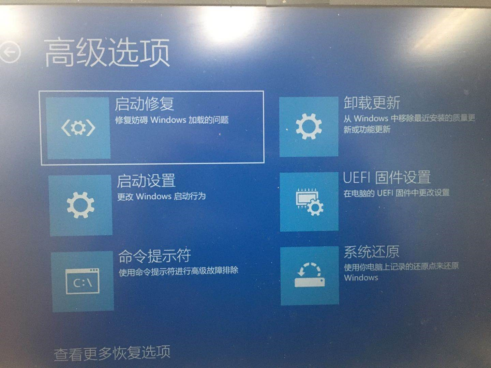

# 虚拟机作业

18信管袁帅 201804213001

一、安装Ubuntu系统

1.	从设置——系统与安全——恢复——高级启动模式——疑难解答——UEFI固件设置——重启——打开虚拟化

2.	下载Ubuntu20.04
3.	在虚拟机存储中添加光驱，光驱为操作系统的iso文件
4.	启动虚拟机
5.	完成安装

二、配置虚拟机网络

如图所示，进行虚拟机网络配置
![4]
![5]
先进行安装，sudo apt-get install

sudo apt install net-tools

安装完毕后，输入ifconfig
![6]
三、ping通主机

在主机中输入ipconfig

如图，获取ip地址192.168.56.1
![7]
如图，在虚拟机中ping该地址，可以产生如图的效果，表示已经ping通
![8]
四、开通http server 服务

输入python3 -m http.server –-directory /root 8000 , 可以产生如图效果
![9]
输入sudo apt install git
![10]
git安装完毕，输入克隆用的代码
![11]
开通http server
![12]
在浏览器中打开127.0.0.1,可得如下网页
![13]

